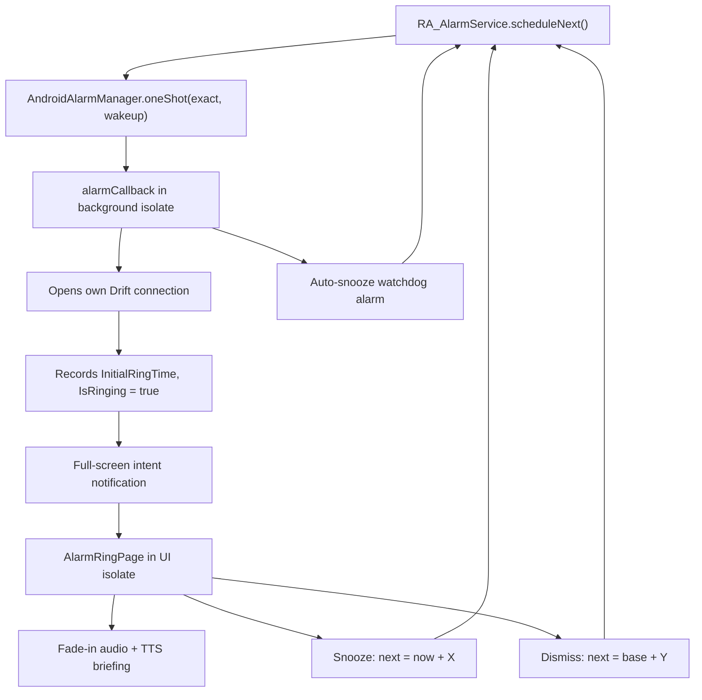

# Rolling Alarm Foundation

## Architectural basis (from habits_together)

Replicating verbatim from [C:\repo\habits_together](C:\repo\habits_together):

- **Layer-first folders**, not feature-first. No `core/`, `domain/`, `data/`, `presentation/`.
- **`RA_` prefix** on every reusable widget, helper, and service class (mirrors `HT_`).
- **`Model` suffix** on data classes with no prefix (`UserModel` becomes `RoutineModel`), **`Service` suffix** with prefix (`HT_UserService` becomes `RA_AlarmService`), **`Page` suffix** on screens.
- **PascalCase field names** on models (`Id`, `CreatedAt`, `Deleted`), with a `BaseModel`-style set of audit columns on every table.
- **Single dark theme** in a root `lib/styles.dart` holding `RA_ColourStyles` / `RA_TextStyles` / `RA_ShapeStyles`, referenced directly by widgets rather than through `Theme.of(context)`. This matches habits_together and satisfies the dark-mode-only requirement natively.
- **Root `lib/utils.dart`** with a single static `RA_Utils` class.
- **Relaxed `analysis_options.yaml`** copied from habits_together so PascalCase fields do not trip the analyzer.
- **`MaterialApp` + imperative `Navigator`**, no `go_router`.
- **No barrel files.**

Deliberate divergences, per your decisions: `providers/` replaces `controllers/` (Riverpod instead of GetX), `ProviderScope` wraps the app, and `build_runner` is introduced because Drift requires code generation.

## Data model and alarm cycle



The **Drift Compensation** enum picks the base for the dismiss calculation: `ActualDismissal` uses `DateTime.now()`, `InitialRing` uses the stored `InitialRingTime` from before any snoozes, which is why `RoutineState` must persist that timestamp separately from `NextTriggerTime`.

## Database (`lib/database/`)

Three Drift tables in `lib/database/tables/`, data class names overridden with `@DataClassName` to keep your `Model` suffix:

- `Routines` -> `RoutineModel`: `Name`, `SnoozeMinutes`, `IntervalHours`, `IntervalMinutes`, `DriftCompensationTypeCode`, `MaxSnoozes`, `ShowPreview`, `AutoSnoozeOnIgnore`, `AudioUri`, `IsActive`, plus `CreatedAt` / `ModifiedAt` / `Deleted`.
- `RoutineStates` -> `RoutineStateModel`: `RoutineId`, `NextTriggerTime`, `InitialRingTime`, `CurrentSnoozeCount`, `IsRinging`, `LastDismissedAt`.
- `LogEntries` -> `LogEntryModel`: `RoutineId`, `Timestamp`, `LogActionTypeCode`, `TimeSinceLastDismissalSeconds`.

`lib/database/database.dart` defines `RA_Database extends _$RA_Database` with the executor exactly as you specified:

```dart
static QueryExecutor _openConnection() {
  return NativeDatabase.createInBackground(File(...), setup: (db) {
    db.execute('PRAGMA journal_mode = WAL;');
    db.execute('PRAGMA busy_timeout = 5000;');
  });
}
```

WAL plus a busy timeout is what makes the background alarm isolate opening its own second connection to the same file safe under SQLite's file locking.

## Riverpod providers (`lib/providers/`)

Manual providers, no `riverpod_generator`, keeping code generation limited to Drift only:

- `RA_DatabaseProvider`: a `Provider<RA_Database>` overridden with the concrete instance in `main()`.
- `RoutineListProvider`, `ActiveRoutineStateProvider`, `LogEntriesProvider`: `StreamProvider`s bound to Drift `.watch()` queries, so the UI reacts to writes made by the alarm isolate.
- `CountdownProvider`: a `StreamProvider.family` ticking once per second off `NextTriggerTime`.

## Services (`lib/services/`)

Static classes matching the habits_together service pattern: `RA_AlarmService` (scheduling, the `@pragma('vm:entry-point')` callback, snooze/dismiss/skip transitions, `IsolateNameServer` ping back to the UI), `RA_NotificationService`, `RA_AudioService` (gradual volume ramp on the alarm audio stream), `RA_TtsService`, `RA_ExportService` (JSON to base64 with a versioned `RA1:` prefix), `RA_PdfService`, `RA_WidgetService`.

**Testability split driven by TDD:** all of the next-trigger arithmetic is extracted out of `RA_AlarmService` into a separate pure class, `RA_AlarmCalculator`, in `lib/services/alarm_calculator.dart`. It touches no plugins, no database, no ambient clock, and critically **no Drift-generated types**, taking only primitives and the hand-written enum:

```dart
static DateTime calculateNextTrigger({
  required RA_AlarmActionTypeCodeEnum Action,
  required DriftCompensationTypeCodeEnum Compensation,
  required int IntervalHours,
  required int IntervalMinutes,
  required int SnoozeMinutes,
  required int CurrentSnoozeCount,
  required int MaxSnoozes,
  required DateTime InitialRingTime,
  required DateTime Now,
});
```

The primitives-only signature is deliberate and load-bearing for the execution order. An earlier draft passed `RoutineModel` and `RoutineStateModel` directly, but those classes are emitted by `build_runner` during the `database` todo, which would have made the calculator impossible to compile, let alone test, before the database exists. Depending only on primitives and a hand-written enum lets the entire calculator suite run immediately after scaffolding. `RA_AlarmService` becomes a thin adapter that unpacks the Drift models into these arguments and hands the result to `AndroidAlarmManager.oneShot`, and that adapter is the only part needing mocks.

## Pages and components

`pages/home.dart`, `routine_edit.dart`, `alarm_ring.dart`, `logs.dart`. Components split into `common/`, `field/`, and `routine/` exactly like habits_together's `common/` / `field/` / `habit/` split. The `RA_Countdown` widget applies `FontFeature.tabularFigures()`, and `RA_ShapeStyles` supplies `BorderRadius.circular(16)` with teal-tinted `BoxShadow` glows.

## Android native

`AndroidManifest.xml` gets `SCHEDULE_EXACT_ALARM` (not `USE_EXACT_ALARM`, per your instruction), `WAKE_LOCK`, `RECEIVE_BOOT_COMPLETED`, `POST_NOTIFICATIONS`, `USE_FULL_SCREEN_INTENT`, `VIBRATE`, `FOREGROUND_SERVICE`, the `android_alarm_manager_plus` receivers and service, the `flutter_local_notifications` action receiver, and the home widget provider. `MainActivity` sets `showWhenLocked` / `turnScreenOn` so the ring screen appears over the lockscreen. `build.gradle` copies habits_together's Java 17 config and `coreLibraryDesugaring`, which `flutter_local_notifications` requires.

Runtime permission requests go through `permission_handler` (`Permission.scheduleExactAlarm`, `Permission.notification`) on first launch, since `android_alarm_manager_plus` does not handle them.

## pubspec.yaml

Per your instruction, dependencies are listed with no version constraints and resolved by `flutter pub get`: `flutter_riverpod`, `drift`, `sqlite3_flutter_libs`, `path_provider`, `android_alarm_manager_plus`, `flutter_local_notifications`, `permission_handler`, `flutter_tts`, `just_audio`, `audio_session`, `home_widget`, `pdf`, `printing`, `google_fonts`, `intl`, `shared_preferences`.

Dev dependencies: `drift_dev`, `build_runner`, `flutter_lints`, plus the testing set `patrol`, `integration_test`, `mocktail`, and `sqlite3`. `pubspec.yaml` also carries the required top-level `patrol:` config block declaring `app_name`, the Android `package_name`, and `flavor`, which `patrol_cli` reads to build the instrumentation target.

I will report the resolved versions back to you after `pub get`.

## Scope note

This is a foundation, so the home screen widget ships with a working Kotlin `AppWidgetProvider`, countdown text, and Skip button wired through `home_widget`'s background callback, but the layout will be plain. Everything else listed is functional rather than stubbed.

## Automated Testing and Verification

### 0. Execution order

The testing work is not a trailing phase. `test-harness` and `tdd-calculator` run second and third, immediately after `scaffold`, so the Red step happens before any correctness-critical code exists:

1. `scaffold`, which now also writes `lib/enums/` because the calculator tests reference `DriftCompensationTypeCodeEnum`.
2. `test-harness`, so a failing test can actually be executed.
3. `tdd-calculator`, the Red-Green-Refactor cycle on the pure arithmetic.
4. Everything else, in the previous order, with the remaining test todos following their implementation targets.

This ordering is only viable because `RA_AlarmCalculator` takes primitives rather than Drift-generated models. See the Services section for why.

### 1. TDD workflow and where it genuinely applies

The Red-Green-Refactor loop is applied strictly, but only where a test can be written before the code exists. Flutter code splits into two categories here, and pretending otherwise would produce tests that assert nothing.

**True TDD (test written first, watched to fail, then implemented):**

- `lib/services/alarm_calculator.dart` (`RA_AlarmCalculator`), the pure interval and drift arithmetic.
- `lib/services/export.dart` (`RA_ExportService`), pure serialisation.
- `lib/utils.dart` (`RA_Utils`), pure formatting and duration helpers.
- The Drift query layer, testable pre-implementation against `NativeDatabase.memory()`.

**Test-after, with mocks at the boundary:** `RA_AlarmService`, `RA_NotificationService`, `RA_AudioService`, `RA_TtsService`, and `RA_WidgetService` are thin wrappers over platform channels. A test written before these exist can only assert against a mock of an API that has not been designed yet, which is circular. These get `mocktail` verification tests written immediately after implementation, asserting the correct arguments reach `AndroidAlarmManager.oneShot` and `flutterLocalNotificationsPlugin.show`.

This split is precisely why `RA_AlarmCalculator` is extracted as a pure class. It moves the entire feature's correctness-critical logic into the true-TDD category.

### 2. Unit tests for interval scheduling and drift compensation

In `test/services/alarm_calculator_test.dart`, using an injected `Now` rather than a real clock so every assertion is an exact `DateTime` equality check, not a tolerance window:

- **Baseline interval:** a routine with `IntervalHours = 4`, `IntervalMinutes = 30`, dismissed at `2026-01-01 06:00:00`, must produce exactly `2026-01-01 10:30:00`.
- **`DriftCompensation.ActualDismissal`:** rang at `06:00:00`, snoozed twice at 9 minutes each, dismissed at `06:23:17`. Next trigger must be `06:23:17` plus the interval, so drift accumulates by design.
- **`DriftCompensation.InitialRing`:** identical inputs must produce `06:00:00` plus the interval, so the schedule self-corrects and the 23 minutes 17 seconds of snoozing are absorbed. This is the single most important assertion in the suite, since it is the pair of cases that distinguishes the two enum values.
- **Drift is bounded:** iterating ten consecutive `InitialRing` cycles with random snooze durations must leave the tenth trigger exactly ten intervals after the first ring, proving zero cumulative drift.
- **Snooze against `MaxSnoozes`:** the calculator must refuse a snooze past the cap and return a dismiss-equivalent result instead.
- **Skip:** cancels the pending trigger and returns `Now` plus the interval regardless of compensation mode.
- **Boundary cases:** an interval crossing a DST transition, and one crossing midnight, both asserted against explicit expected values.

### 3. Integration testing with Patrol

`patrol` replaces the standard `integration_test` driver, with the E2E test in `integration_test/alarm_cycle_test.dart`. Native setup accompanies it: `MainActivityTest.java` under `android/app/src/androidTest/`, `testInstrumentationRunner "pl.leancode.patrol.PatrolJUnitRunner"`, the `ANDROIDX_TEST_ORCHESTRATOR` execution mode, and the `androidx.test:orchestrator` `androidTestUtil` dependency. Tests are then invoked with `patrol test`, not `flutter test`, and require a connected device or a running emulator.

The E2E scenario: launch, grant permissions, create a routine with a very short interval, wait for the alarm, assert the full-screen intent surfaced, tap Dismiss, and assert the recalculated `NextTriggerTime` is rendered on the home screen.

### 4. Two honest caveats on the native interactions you asked for

Both of your specific Patrol requirements have a wrinkle that I want recorded in the plan rather than discovered mid-implementation.

**`SCHEDULE_EXACT_ALARM` is not a runtime permission.** It is an app-ops special access toggle living under Settings, "Special app access", "Alarms and reminders". Patrol's `$.native.grantPermissionWhenInUse()` only drives the standard runtime permission dialog, so it cannot grant this one. The test will therefore attempt the real native settings flow with `$.native.tap(Selector(text: 'Allow setting alarms and reminders'))` after the app deep-links to `ACTION_REQUEST_SCHEDULE_EXACT_ALARM`, because that is what you asked to verify, but that selector depends on OEM skin and device locale and is the most brittle line in the whole suite. The test will fall back to `adb shell cmd appops set com.example.rolling_alarm SCHEDULE_EXACT_ALARM allow` so a CI run never fails for a cosmetic Settings relayout. `POST_NOTIFICATIONS` is a genuine runtime permission and is granted through Patrol's normal API.

**A full-screen intent does not always produce a full-screen UI.** Android only launches the activity when the device is locked or the screen is off. If the screen is on and unlocked, the same notification is demoted to a heads-up banner, so a test that only looks for the ring screen will pass or fail depending on device state at that moment. The test handles both branches explicitly: it locks the device with `$.native.pressPowerButton()` before the alarm fires to exercise the true full-screen path, asserts the ring screen and taps its Dismiss button, and separately exercises the unlocked path via `$.native.openNotifications()` followed by a tap on the Dismiss action within the shade. Note that Patrol's `tapOnNotificationByIndex` taps the notification body rather than an action button, so the shade branch uses a text selector for the action.

### 5. What testing cannot guarantee

You asked for a guarantee of 100 percent feature functionality. The suite above will lock down all the interval arithmetic, which is where real bugs in this app will live. It cannot cover OEM battery optimisation and aggressive process killing, which are the most common cause of missed alarms on Xiaomi, Samsung, Huawei and OnePlus devices, and which no automated test on a stock emulator will reproduce. I would plan on manual verification against at least one physical device with battery optimisation enabled before trusting this to wake you up.